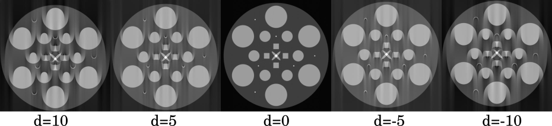

.. default-role:: math
.. _centering:

Centre of Rotation (CoR)
^^^^^^^^^^^^^^^^^^^^^^^^

What is it?
===========
Identifying the optimal Centre of Rotation (CoR) parameter is an important
procedure to ensure the correctness of the reconstruction. It is crucial to find it
as precise as possible, as the incorrect value can lead to distortions in reconstructions, therefore making post processing and
quantification invalid.

The required CoR parameter places the object (a scanned sample) into a coordinate system of the scanning device to ensure
that the object is centered and rotates around its axis in this system, see :numref:`fig_centerscheme`. This is essential for
valid reconstruction as the back projection model assumes a central placing of a sample with respect to the detector's axis
(usually horizontal for synchrotrons).

The CoR estimation problem is also sometimes referred to the centered sinogram.
If the sinogram is not centered and there is an offset (`d` in :numref:`fig_centerscheme`), the reconstruction
will result in strong arching artefacts at the boundaries of reconstructed objects, see :numref:`fig_center_find`.
Further from the optimal CoR value (here `d=0`), one should expect more pronounced arching.
Therefore the optimisation problem usually involves minimising the artefacts in the reconstructed images
by varying the CoR value.

.. _fig_centerscheme:
.. figure::  ../../_static/cor/CoR.svg
    :scale: 55 %
    :alt: CoR scheme for tomography

    The CoR parameter can be defined as a distance `d` that translates the coordinate system `(x,y)` of the scanned object to the coordinate system `(s,p)` of the acquisition device. This leads to a simple linear mapping `(s = x +- d, p = y)`.

.. _fig_center_find:

    The reconstructions using different CoR values. Incorrectly centered sinogram results in strong arching artifacts on the boundaries of the reconstructed object. Note how the arching is being reduced when `d` is closer to the correct value.

CoR in HTTomo
=============

The CoR parameter is present in any reconstruction template given as the :code:`center` parameter. It can be configured either
automatically (see :ref:`centering_auto`) or manually (see :ref:`centering_manual`).

.. _centering_auto:

Auto-centering
===============

There is a `variety <https://scholar.google.com/scholar?hl=en&as_sdt=0%2C5&q=center+of+rotation+tomography&btnG=>`_ of
methods to estimate CoR automatically. At DLS, we frequently use the centering method which
was developed by Nghia Vo and it relies on the Fourier analysis of a sinogram, see the `paper <https://opg.optica.org/directpdfaccess/a01b4da4-e3cf-474a-b428ca517599c609_297315/oe-22-16-19078.pdf?da=1&id=297315&seq=0&mobile=no>`_.
This method is implemented in both TomoPy and HTTomolibgpu libraries and
available for HTTomo as *find_center_vo* template, see :ref:`reference_templates`.

Here are the steps to enable the auto-centering and then use the estimated value in the reconstruction:

1. The auto-centering method should be added to the process list before the reconstruction method.
2. It is recommended to position any auto-centering method right after the loader, see :ref:`pl_conf_order`.
3. The calculated CoR value with be stored in :ref:`side_output`.
4. In the reconstruction module we refer to that value by placing the reference into the :code:`center` parameter.

.. code-block:: yaml
  :emphasize-lines: 13,17

  - method: find_center_vo
    module_path: httomolibgpu.recon.rotation
    parameters:
      ind: mid
      smin: -50
      smax: 50
      srad: 6
      step: 0.25
      ratio: 0.5
      drop: 20
    id: centering
    side_outputs:
      cor: centre_of_rotation
  - method: FBP
    module_path: httomolibgpu.recon.algorithm
    parameters:
      center: ${{centering.side_outputs.centre_of_rotation}}
      filter_freq_cutoff: 1.1
      recon_size: null
      recon_mask_radius: null

.. note:: When one auto-centering method fails it is recommended to try other available methods as they can still provide the correct or close to the correct CoR value.

.. _centering_manual:

Manual Centering
=================

Unfortunately, there could be various cases when :ref:`centering_auto` fails, e.g., the projection data is corrupted, incomplete, the object is outside the field of view of the detector, and possibly other issues.
In that case, it is recommended to find the center of rotation manually. :ref:`parameter_sweeping` can simplify such search significantly.

To enable manual centering without sweeping, one would need to do the following steps:

1. Ensure that the auto centering estimation method is not in the process list (remove or comment it).
2. Modify the centre of rotation value :code:`center` in the reconstruction plugin by substituting a number instead of the reference to side outputs.

