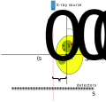

.. default-role:: math
.. _centering:

Centre of rotation (CoR)
^^^^^^^^^^^^^^^^^^^^^^^^^
An important procedure to ensure the correctness of the reconstruction is 
the validity of the CoR parameter. This parameter is present in any reconstruction template as 
the :code:`center` parameter and can be configured either automatically (see :ref:`centering_auto`)
or manually (see :ref:`centering_manual`).

The correct CoR parameter places the object (sample) in a valid coordinate system for reconstruction, see :numref:`fig_centerscheme`.
This is equivalent for the sinogram is being centered. If the sinogram is not centered and there is an offset `d`,
then the reconstruction will have strong arching artefacts, see :numref:`fig_center_find`. Further from the correct center value (here `d=0`),
one should expect more pronounced arching on the boundaries of the reconstructed object. 

.. _fig_centerscheme:

    The CoR parameter can be defined as a distance `d` that translates the coordinate system of the object `(x,y)` to the cordinate system `(s,p)` of the acquisition device. This consists in a simple linear mapping `(s = x + d, p = y)`.

.. _fig_center_find:
.. figure::  ../../_static/cor/corr_select.png
    :scale: 85 %
    :alt: Finding CoR

    The reconstructions using different CoR values. Incorrectly centered sinogram results in strong arching artefacts on the boundaries of the reconstructed object. Note how the arching is being reduced when closer to the correct value. 

.. _centering_auto:

Auto-centering
===============

There is a `variety <https://scholar.google.com/scholar?hl=en&as_sdt=0%2C5&q=center+of+rotation+tomography&btnG=>`_ of 
methods to estimate CoR automatically. At DLS we use a centering method which 
was developed by Nghia Vo and it relies on Fourier analysis of a sinogram, see the `paper <https://opg.optica.org/directpdfaccess/a01b4da4-e3cf-474a-b428ca517599c609_297315/oe-22-16-19078.pdf?da=1&id=297315&seq=0&mobile=no>`_. 
This method is implemented in both TomoPy and HTTomolibgpu libraries and 
available for HTTomo as *find_center_vo* template, see :ref:`reference_templates`. 

Here are the steps to enable the auto-centering: 

1. The auto-centering method should be added to a process list before the reconstruction.
2. The value calculated in the centering routine :code:`cor` stored in the output dataset :code:`data_out`.
3. The CoR value :code:`cor` needs to be passed to the reconstructor into the :code:`center` parameter. 

.. code-block:: yaml
  :emphasize-lines: 4,16

   - tomopy.recon.rotation:
       find_center_vo:
         data_in: tomo
         data_out: cor
         ind: mid
         smin: -50
         smax: 50
         srad: 6.0
         step: 0.25
         ratio: 0.5
         drop: 20
   - tomopy.recon.algorithm:
       recon:
         data_in: tomo
         data_out: tomo
         center: cor
         sinogram_order: false
         algorithm: gridrec
         init_recon: null

.. note:: The auto-centering plugin is computationally expensive and therefore one can specify :code:`ind: mid` to be calculated only for a middle slice of your previewed data, see :ref:`previewing`. 

.. _centering_manual:

Manual Centering
=================
In case when :ref:`centering_auto` does not work (e.g. the data is corrupted, incomplete or/and not within the field of view of the detector), 
one can use manual centering with :ref:`parameter_tuning` enabled.

For manual centering you need to do the following steps:

1. Ensure that the auto centering estimation method is not in the process list (remove or comment it). 
2. Modify the centre of rotation value :code:`center` in the reconstruction plugin by substituting a number instead of the :code:`cor` parameter.
3. If you would like to sweep across multiple CoR values, you can do that with a special phrase in your template :code:`!Sweep` or :code:`!SweepRange`. Please see more on :ref:`parameter_tuning_range`.

