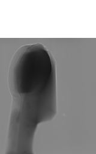

.. default-role:: math
.. _previewing:

Previewing
^^^^^^^^^^

Previewing is the way to change the dimensions of the input data by reducing them. 
It also can be interpreted as a data cropping or data slicing operation. It is usually
needed to reduce the size of the input data, and therefore accelerate the processing.
It is also recommended to use when the search for parameters is required, see :ref:`parameter_tuning`.
Skip to :ref:`previewing_enable` for information about how to use it in HTTomo.

Previewing in the Loader
========================

Previewing is an important part of the loader (see :ref:`reference_loaders`). Here we present a brief explanation on how
to operate a :code:`preview` parameter in the *standard_tomo* loader (see the corresponding template in
:ref:`reference_templates_httomo`).

.. note:: HTTomo assumes that the input data is a 3 dimensional (3D) array, where the 1st axis is the *angular* dimension, the 2nd axis is the *vertical* `Y`-detector dimension and the 3rd axis is the *horizontal* `X`-detector dimension (see :numref:`fig_dimsdata`).

.. _fig_dimsdata:
.. figure::  ../../_static/dims_prev.svg
    :scale: 55 %
    :alt: 3D data

    3D projection data and their axes 

Full data preview
+++++++++++++++++

By default the :code:`preview` parameter in the YAML template of the loader 
allows the **full** data to be processed without any changes, i.e., the previewing is disabled:

.. code-block:: yaml  

    preview:
        -  # angular dim
        -  # Y-dim
        -  # X-dim

The above can be also written as: 

.. code-block:: yaml  

    preview:
        - null  # angular dim
        - null  # Y-dim
        - null  # X-dim

Both of the cases will be parsed to a following list in Python :code:`[:,:,:]`.

.. _previewing_enable:

Enabling data preview
+++++++++++++++++++++

In order to change the input data dimensions and accelerate the processing 
pipeline one can do two of the following operations. *Although this is optional, by doing
this you reduce the size of the reconstructed volume which can have a
significant impact on the post-processing time.* In the figure bellow the projections 
have been cropped vertically and horizontally. 

Before cropping |pic1| and after |pic2|

.. |pic1| image:: ../../_static/preview/uncropped.gif
   :width: 44%

1. Reduce the size of the vertical dimension (detector- `Y`) by removing blank regions in your data (top and bottom cropping),
   see :numref:`fig_dimsdataY`. The blank areas, if any, can be established by looking through the sequence of raw projections. 

    .. code-block:: yaml

        preview:
            -  
            - start: 200
              stop: 1800
            -  
    
    This will crop the data starting at slice 200 and finishing at slice 1800, 
    therefore resulting in the data with the vertical dimension equal to 1600 pixels. 
    In Python this will be interpreted as :code:`[:,200:1800,:]`.
    
.. _fig_dimsdataY:

    Cropping detector- `Y` dimension of 3D projection data

2. Reduce the size of the horizontal dimension (detector- `X`) by removing blank regions in your data (cropping the left and right sides),
   see :numref:`fig_dimsdataX`.
   
   .. warning::
    Please be aware that the cropping of this dimension can create issues with the automatic centering 
    and potentially lead to reconstruction artefacts, especially if iterative methods are used. 
    It is a general practice to be more conservative with the cropping of the `X` detector.

   .. code-block:: yaml

        preview:
            -  
            - 
            - start: 100
              stop: 2000 
    
.. _fig_dimsdataX:
.. figure::  ../../_static/dims_prevX.svg
    :scale: 55 %
    :alt: 3D data, X slicing

    Cropping detector- `X` dimension of 3D projection data

One can combine vertical and horizontal cropping with:

   .. code-block:: yaml

        preview:
            -  
            - start: 200
              stop: 1800
            - start: 100
              stop: 2000 