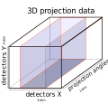

.. default-role:: math
.. _previewing:

Previewing
^^^^^^^^^^

Previewing is the way to change the dimensions of the input data by reducing them.
It also can be interpreted as a data cropping or data slicing operation.

Reduction of the input data is often done to remove unnecessary/useless
information, and to accelerate the processing time. It is also recommended to use
when searching for optimal parameter values, see :ref:`parameter_sweeping`. Skip to
:ref:`previewing_enable` for information about how to use it in HTTomo.

Previewing in the loader
========================

Previewing is an important part of the loader (see :ref:`reference_loaders`). Here,
a brief explanation is given on how to use the :code:`preview` parameter in the
:code:`standard_tomo` loader.

.. note:: HTTomo assumes that the input data is a three dimensional (3D) array,
   where the 1st axis is the *angular* dimension, the 2nd axis is the *vertical*
   `Y`-detector dimension and the 3rd axis is the *horizontal* `X`-detector
   dimension (see :numref:`fig_dimsdata`).

.. _fig_dimsdata:

    3D projection data and their axes

Structure of the :code:`preview` parameter value
================================================

The value of the :code:`preview` parameter has three fields, one for each axis in
the 3D input data, and also a :code:`start` and :code:`stop` field for each
dimension:

.. code-block:: yaml

   preview:
    angles:
      start:
      stop:
    detector_y:
      start:
      stop:
    detector_x:
      start:
      stop:

.. warning:: Note that previewing in the :code:`angles` dimension is not yet
   supported by loaders in HTTomo, but ignoring data along this dimension is a
   feature that will be coming in a future release.

Full data preview
=================

If the :code:`preview` parameter is omitted entirely in the loader configuration,
then the full data will be selected and no cropping/previewing will be applied. Ie,
previewing is disabled in this case.

.. _previewing_enable:

Enabling data preview
=====================

In order to change the input data dimensions and accelerate the processing
pipeline, one can do two of the following operations.

.. note:: Although this is optional, by doing this the size of the reconstructed
   volume is reduced without any detriment to the data, which can result in a
   significant speedup in post-processing analysis time.

In the figure below the projections have been cropped vertically and horizontally.

Before cropping |pic1| and after |pic2|

.. |pic1| image:: ../../_static/preview/uncropped.gif
   :width: 44%

.. |pic2| image:: ../../_static/preview/cropped.gif
   :width: 27%

1. Reduce the size of the vertical dimension (detector- `Y`) by removing blank regions in your data (top and bottom cropping),
   see :numref:`fig_dimsdataY`. The blank areas, if any, can be established by looking through the sequence of raw projections.

   .. code-block:: yaml

       preview:
         detector_y:
           start: 200
           stop: 1800

   This will crop the data starting at slice 200 and finishing at slice 1800,
   therefore resulting in the data with the vertical dimension equal to 1600 pixels.
   In Python this will be interpreted as :code:`[:,200:1800,:]`.

.. _fig_dimsdataY:
.. figure::  ../../_static/preview/dims_prevY.svg
    :scale: 55 %
    :alt: 3D data, Y slicing

    Cropping detector- `Y` dimension of 3D projection data

2. Reduce the size of the horizontal dimension (detector- `X`) by removing blank regions in your data (cropping the left and right sides),
   see :numref:`fig_dimsdataX`.

   .. warning::
    Please be aware that cropping this dimension can create issues with the automatic centering
    and potentially lead to reconstruction artefacts, especially if iterative methods are used.
    It is general practice to be more conservative with the cropping of the `X`
    detector dimension.

   .. code-block:: yaml

       preview:
         detector_x:
           start: 100
           stop: 2000

   In Python this will be interpreted as :code:`[:,:,100:2000]`.

.. _fig_dimsdataX:

    Cropping detector- `X` dimension of 3D projection data

One can combine vertical and horizontal cropping with:

.. code-block:: yaml

    preview:
      detector_y:
        start: 200
        stop: 1800
      detector_x:
        start: 100
        stop: 2000

The :code:`mid` value
=====================

The :code:`detector_y` and :code:`detector_x` dimension fields also support the
value :code:`mid` in addition to the :code:`start` and/or :code:`stop` fields.
Specifying :code:`mid` for either of these dimensions will result in the middle
three slices of that dimension being selected.

.. warning:: The :code:`angles` dimension field doesn't support the value
   :code:`mid`

Rules for omitting fields in the :code:`preview` parameter value
================================================================

One may have noticed that, in many of the :code:`preview` parameter value examples
above, some fields were omitted. It's infrequently needed to crop all three
dimensions, and sometimes when cropping, only either the start or end is of
interest.

With these in mind, along the general notion that anything is more readable
when unnecessary information is omitted, there are several ways in which the

- dimension fields
- start/stop fields

in the :code:`preview` parameter value can be omitted in the process list, and
still achieve the desired cropping behavior.

Omitting one or more dimension fields
-------------------------------------

If any of the three top-level dimension fields are omitted, then no cropping will
be applied to the omitted dimension(s).

If a top-level dimension is provided but given no value, then no cropping will be
applied to that dimension either. Ie, the following configuration will select the
entire input data and apply no cropping/previewing:

.. code-block:: yaml

    preview:
      angles:
      detector_y:
      detector_x:

Omitting the :code:`start` or :code:`stop` fields
-------------------------------------------------

For a given dimension field:

- if the :code:`start` field is omitted, then the start value is assumed to be 0
- if the :code:`stop` field is omitted, then the stop value is assumed to be the
  very last element in that dimension
