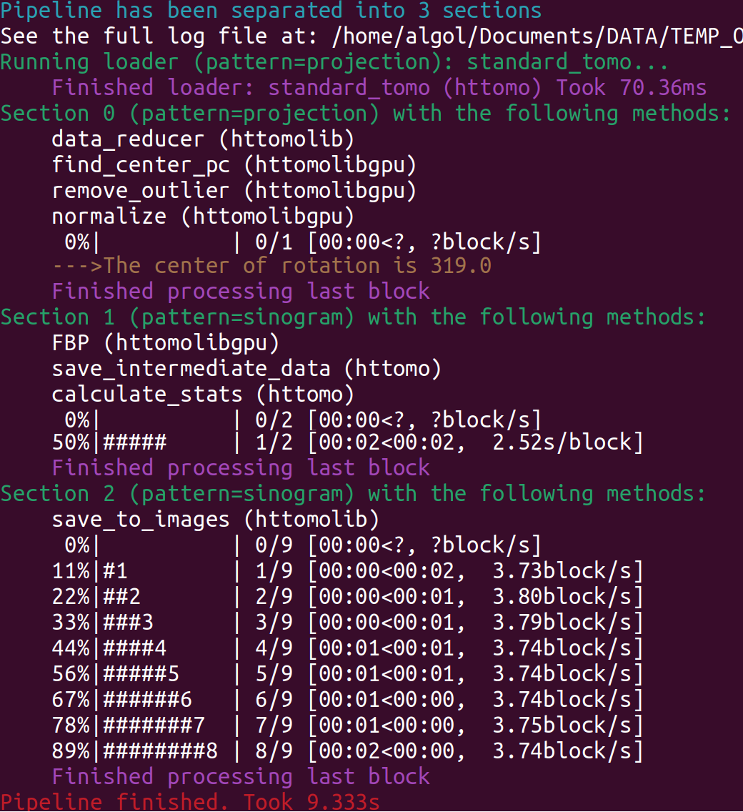

.. _info_logger:

Interpret Log File
======================

This section contains information on how to interpret the log file created by HTTomo.

HTTomo uses :code:`loguru` software to unify and simplify the logging system. During the job execution, the concise information
goes to the terminal (see :numref:`fig_log`) and also to the :code:`user.log` file. More verbose information, that is usually
needed to debug the run, is saved into the :code:`debug.log` file. Let us explain few main elements of the :code:`user.log`
file and also stdout.

.. _fig_log:

    The screenshot of the terminal output (AKA stdout) which also goes into the :code:`user.log` file.

* :code:`Pipeline has been separated into N sections`
   This means that `N` :ref:`info_sections` created for this pipeline and each section contains a certain amount of methods grouped together to work on :ref:`blocks_data`. The progress can be seen in every
   section processing all of the input data divided into :ref:`chunks_data` and :ref:`blocks_data`, before continue to the next section.

* :code:`Running loader`
   The loader does not belong to sections and always at the start of the pipeline. Note that the loader
   loads the data using the specific :code:`pattern=projection` (See more :ref:`info_reslice`). The same pattern is used by the
   following section.

* :code:`Section N with the following methods`
   Each section contains a number of methods that run sequentially for each :ref:`blocks_data`
   of data. When all blocks are processed, the user will see the message :code:`Finished processing the last block`. This means that all of the
   input data have been processed in this section and the pipeline moves to the next section, if it exists.

* :code:`50%|#####     | 1/2 [00:02<00:02,  2.52s/block]`
   These are the progress bars showing how much data is being processed in every section.
   The percentage progress bar demonstrates how many blocks have been processed by the `M` number of methods of the current section. Specifically in this case
   we have :code:`1/2`, which means that one of two blocks completed (hence `50%`). Then :code:`00:02<00:02` shows the time in seconds to
   reach the current block (time elapsed) and the remaining time to complete all iterations over blocks. The :code:`2.52s/block` part is an
   estimation of how much time it's taking per block. When the time per block is less than one second then this can be presented as :code:`block/s` instead.
   See :code:`save_to_images` progress report, for instance.

.. note:: When interpreting progress bars, one possible misunderstanding can be an association of the progress with the methods completed. Because each piece of data (a block) can be processed by multiple methods, we report on how many blocks have been processed instead.