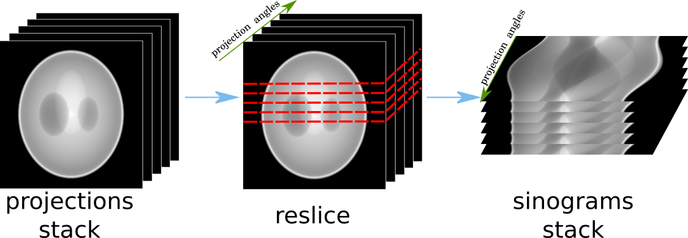

.. _howto_process_list:

Configure process list using templates
======================================

This section explains how to build a process list (see more on :ref:`explanation_process_list`) from YAML templates (see more on :ref:`explanation_templates`).

We focus on several important aspects which can be helpful to keep in mind before configuring the process list. They are :ref:`pl_conf_order`, :ref:`pl_reslice`, and :ref:`pl_platform_sections`. The first two topics are
recommended to read if you are new to HTTomo and :ref:`pl_platform_sections` is for more in-depth information about the inner workings of HTTomo when using GPUs.

**The better understanding of those elements will enable you to build more computationally efficient pipelines**. 

Please become familiar with :ref:`explanation_yaml` and use editors that support it. We can recommend Visual Studio Code, Atom, Notepad++. 
To avoid errors during the HTTomo run using a process list, please validate it first using YAML checker tool (see :ref:`utilities_yamlchecker`).

.. _pl_conf_order:

Methods order
-------------
To build a process list with multiple tasks, you will need to copy-paste the content of YAML files from the provided :ref:`reference_templates`.
The general rules for building a process list are the following: 

* Any process list starts with :ref:`reference_loaders` which are provided as :ref:`reference_templates`.
* The execution order of the methods in the process list is **sequential** starting from the top to the bottom.

For example, for tomographic processing, we can build the following process list by using mostly TomoPy templates.

.. dropdown:: A basic TomoPy full data processing pipeline

    .. literalinclude:: ../../../../samples/pipeline_template_examples/01_basic_cpu_pipeline_tomo_standard.yaml

In this process list the data will be loaded using the standard HTTomo loader to read `HDF5 <https://www.hdfgroup.org/solutions/hdf5/>`_ dataset. 
Then the loaded data is normalised, the centre of rotation estimated and provided to the reconstruction. 
Finally the result of the reconstruction will be saved as tiff files using HTTomolib library as a backend. 
Note that the result of the reconstruction will be also saved as an HDF5 file. 

.. _pl_reslice:

Re-slicing
-------------
The re-slicing of data happens when we need to access a slice which is orthogonal to the current one. 
In tomography, we normally work in the space of projections or in the space of sinograms. Different methods require different slicing 
orientations, or, as we call it, a *pattern*. The change of the pattern is a **re-slice** operation or a transformation of an array by 
re-slicing in a particular direction. For instance, from the projection space/pattern to the sinogram space/patterns, as in :numref:`fig_reslice`.

.. _fig_reslice:

    The re-slicing operation for tomographic data. The transformation from the stack of projections to the stack of sinograms by slicing the 3D array in the direction parallel to the projection angles.

In HTTomo, the re-slicing operation is performed on the CPU as we need to access all the data. Even if the pipeline consists of only GPU methods stacked together, 
the re-slicing step will transfer the data from the GPU device to the CPU memory. This operation can be costly for big datasets and we recommend to minimise the number of 
re-slicing operations in your pipeline. Normally for tomographic pre-processing and reconstruction there is just one re-slice needed. HTTomo checks if there is more than 
one reslice in the pipeline and warn the user about it. The user will be prompted to change the order of the methods to minimise the number of the reslicing operations. 

For example to execute the methods bellow, **two** re-slicing operations needed:

.. code-block:: yaml
    
    1. normalisation
    2. median_filter
    3. centering
    4. paganin_filter
    5. reconstruction

The main issue here is that the :code:`centering` method requires pattern to be `sinogram`, :code:`paganin_filter` needs `projections` and 
:code:`reconstruction` needs sinogram pattern again. Therefore we need to re-slice two times to accommodate for that. To remove one 
reslice operation and obtain exactly the same result (but quicker), one needs to change the order of methods like this: 

.. code-block:: yaml
    
    1. normalisation
    2. median_filter
    3. paganin_filter
    4. centering    
    5. reconstruction

To conclude, it is useful to look for the order of methods in your pipelines and 
rearrange them to reduce the amount of potentially unnecessary reslicing steps.

.. _pl_platform_sections:

Platform Sections
-----------------
to be added...
