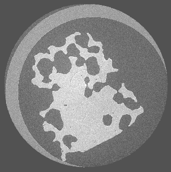

.. _real-data-sandstone:

Sandstone data
==============

This example reconstructs experimental tomography data from a sandstone rock
sample collected at the I12 beamline at Diamond Light Source. The dataset is
available from the `Sandstone rock tomographic data Zenodo record`_.

.. _fig_sandstone:

   Reconstructed slice of the sandstone dataset

.. _Sandstone rock tomographic data Zenodo record: https://doi.org/10.5281/zenodo.10033401

Download the data
+++++++++++++++++

The Zenodo record provides two datasets:

* ``dataset_sandstone1.zip`` (17.9 GB); and
* ``dataset_sandstone2.zip`` (17.8 GB).

Download either archive from Zenodo and extract it to a directory with enough
space for both the archive and its extracted contents. The instructions below
apply to either dataset.

.. note::

   These are large downloads. Make sure that sufficient storage is also
   available for the reconstruction and TIFF images produced by HTTomo.

After extraction, identify the HDF5 or NeXus tomography file that will be
passed to HTTomo as ``INPUT_FILE``.

GPU reconstruction pipeline
+++++++++++++++++++++++++++

The :ref:`LPRec3d pipeline <tutorials_pl_templates_gpu>` uses GPU-accelerated
methods for correction, centre finding, stripe removal and reconstruction. It
reconstructs the volume with ``LPRec3d_tomobar`` and saves the result as TIFF
images.

This pipeline requires a CUDA-enabled GPU and the HTTomolibGPU and ToMoBAR
backends. See :ref:`backends_list` for the available processing libraries.

Copy the following pipeline into a file named
``LPRec3d_tomobar.yaml``:

.. dropdown:: LPRec3d GPU pipeline for the sandstone dataset

   .. literalinclude:: ../../../pipelines_full/LPRec3d_tomobar.yaml
      :language: yaml

The standard loader in this pipeline uses automatic dataset discovery. If the
downloaded file does not follow the NXtomo layout, replace the loader's
``data_path``, ``image_key_path`` and ``rotation_angles`` values with the
corresponding paths in the input file. See :ref:`reference_loaders` for loader
configuration details.

.. warning::

   Use :ref:`previewing` of the vertical detector to avoid running full data reconstruction on memory-limited workstations. Use, for instance, 10 slices `preview` in the loader
   
   .. code-block:: yaml

       preview:
         detector_y:
           start: 1000
           stop: 1010
