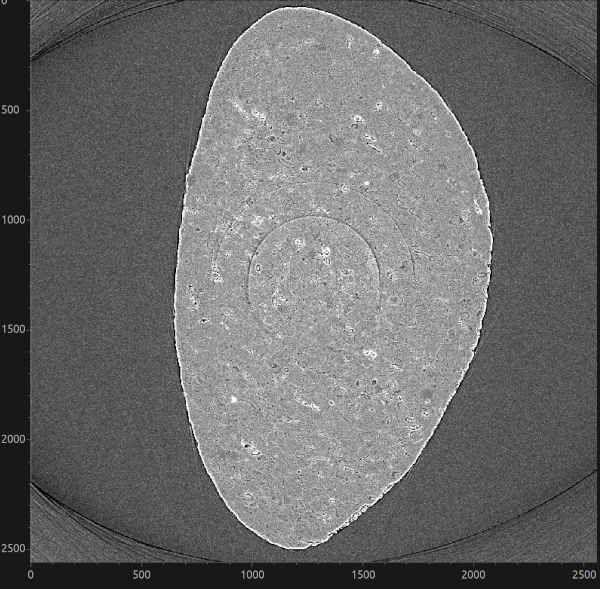

.. _real-data-stripes:

Stripe-removal data
===================

This example processes the ``68067.nxs`` tomography dataset collected at the
I12 beamline at Diamond Light Source. The data contain full, partial,
unresponsive, fluctuating and blurry stripes, which appear as ring artefacts in
reconstructed images. They accompanied the paper `Superior techniques for
eliminating ring artifacts in X-ray micro-tomography`_ and are available from
the `stripe-removal data Zenodo record`_.

.. _fig_stripes:

   Reconstructed slice of the dataset

.. _Superior techniques for eliminating ring artifacts in X-ray micro-tomography: https://doi.org/10.1364/OE.26.028396
.. _stripe-removal data Zenodo record: https://doi.org/10.5281/zenodo.1443568

Download the data
+++++++++++++++++

Download ``Datasets.zip`` (26.7 GB) from Zenodo and extract it. The raw data
used in this example are in ``Datasets/Data_Fig25/Raw_data``:

* ``68067.nxs`` (422.3 kB) contains the scan metadata; and
* ``pco1-68067.hdf`` (21.5 GB) contains the projections, flat fields and dark
  fields.

Keep these two files together because the NeXus file links to the HDF5 file.
Pass ``68067.nxs``, rather than ``pco1-68067.hdf``, to HTTomo as the
``INPUT_FILE``.

.. note::

   This is a large download. Allow enough space for the archive, its extracted
   contents, the reconstruction and any TIFF images produced by HTTomo.

GPU reconstruction pipeline
++++++++++++++++++++++++++++

The :ref:`LPRec3d pipeline <tutorials_pl_templates_gpu>` uses the
``remove_all_stripe`` method from HTTomolibGPU. This method combines the
sorting, large-stripe and dead-stripe techniques described in the paper, making
it a suitable starting point for a dataset containing several types of stripe.
The pipeline then reconstructs the corrected data with ``LPRec3d_tomobar`` and
saves the result as TIFF images.

This pipeline requires a CUDA-enabled GPU and the HTTomolibGPU and ToMoBAR
backends. See :ref:`backends_list` for the available processing libraries.

Copy the following pipeline into a file named
``LPRec3d_tomobar.yaml``:

.. dropdown:: LPRec3d GPU pipeline for the stripe-removal dataset

   .. literalinclude:: ../../../pipelines_full/LPRec3d_tomobar.yaml
      :language: yaml

The standard loader uses automatic NXtomo dataset discovery and this dataset follows that. 

.. warning::

   Preview a small range of the vertical detector before reconstructing the
   full dataset. For example, use ten slices while tuning the stripe-removal
   parameters:

   .. code-block:: yaml

      preview:
        detector_y:
          start: 1000
          stop: 1010

Comparing stripe-removal methods
++++++++++++++++++++++++++++++++

The stripe-removal stage is located after dark/flat-field correction and before
``minus_log`` in the pipeline. To compare filters, replace
``remove_all_stripe`` with one of the stages below and write each run to a
different output directory. Also run the pipeline once without a stripe-removal
stage to provide an uncorrected reference.

Sorting-based removal
---------------------

``remove_stripe_based_sorting`` is particularly effective for full and partial
stripes. A larger median-filter window removes broader stripes but can also
smooth genuine detector-direction features.

.. code-block:: yaml

   - method: remove_stripe_based_sorting
     module_path: httomolibgpu.prep.stripe
     parameters:
       size: 21
       dim: 1

Fourier-wavelet removal
-----------------------

``remove_stripe_fw`` suppresses stripe components using a Fourier-wavelet
filter. Increase ``sigma`` for stronger damping and compare the reconstruction
with the sorting-based result to check that sample features have been
preserved.

.. code-block:: yaml

   - method: remove_stripe_fw
     module_path: httomolibgpu.prep.stripe
     parameters:
       sigma: 2
       wname: db5
       level: null

Titarenko removal
-----------------

``remove_stripe_ti`` corrects detector-channel variations using the Titarenko
method. Lower ``beta`` values apply stronger filtering.

.. code-block:: yaml

   - method: remove_stripe_ti
     module_path: httomolibgpu.prep.stripe
     parameters:
       beta: 0.1

Use the same detector preview and reconstruction settings for every run. Compare
both the remaining rings and the preservation of fine sample features; the
strongest-looking correction is not necessarily the most faithful one.
