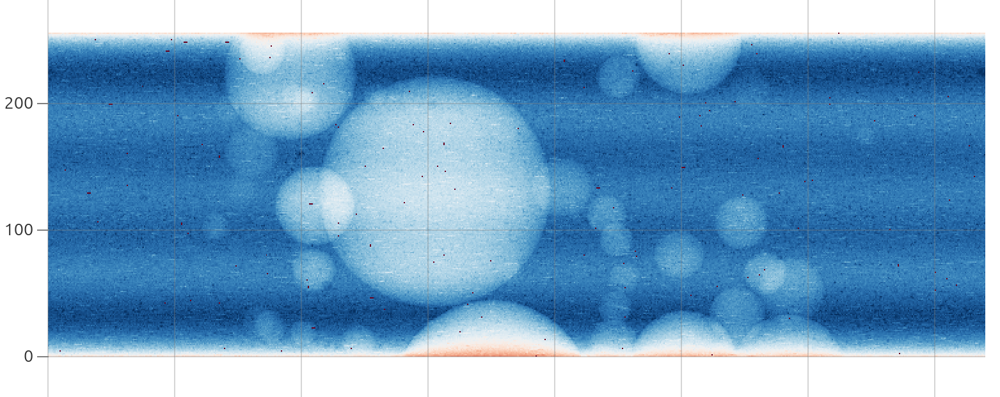

.. _synthetic-data-example:

Generate synthetic data
=======================

This tutorial uses `TomoPhantom <https://dkazanc.github.io/TomoPhantom/>`_ to
create a synthetic tomography dataset that can be processed directly by HTTomo.
Synthetic data can include controlled artefacts, such as, zingers, stripes, noise, misalignment and others.
It makes it useful for testing the robustness of processing methods.

The data output follows the `NXtomo application definition
<https://manual.nexusformat.org/classes/applications/NXtomo.html>`_ and contains
projections, flat-field images, dark-field images and rotation angles. See more information about the NXtomo format 
in :ref:`create_nxtomo`.

Install TomoPhantom
-------------------

Install TomoPhantom and the generator's optional dependencies in the same Conda
environment as HTTomo:

.. code-block:: console

   $ conda install -c httomo -c conda-forge "tomophantom>=3.1.5" psutil scikit-image

Prepare the detector settings
-----------------------------

Download the following example configurations and place them in a new working
directory:

* :download:`artefacts.json <data/artefacts.json>` adds stripes and zingers to
  the projections.
* :download:`flat_settings.json <data/flat_settings.json>` configures the
  simulated flat-field images and detector response.

The files are optional and can be edited to create different detector
conditions. See the `TomoPhantom artefacts documentation
<https://dkazanc.github.io/TomoPhantom/howto/simulate.html>`_ for the available
settings.

Generate the dataset
--------------------

From the directory containing the JSON files, run:

.. code-block:: console

   $ python -m tomophantom.scripts.nxs_generator \
       --realistic \
       --model-number 18 \
       --sinogram-shape 256 512 740 \
       --flats 20 \
       --darks 10 \
       --source-intensity 20000 \
       --artefacts artefacts.json \
       --flat-settings flat_settings.json \
       --seed 1 \
       --output-path tomodata_synth.nxs

The main options are:

``--model-number``
   The model selected from the TomoPhantom 3D phantom library.

``--sinogram-shape``
   The detector height, number of projection angles and detector width.

``--flats`` and ``--darks``
   The number of flat-field and dark-field images to generate.

``--source-intensity``
   The simulated source intensity used by the detector noise model.

``--seed``
   The random seed used to make the simulation reproducible.

For a faster test, reduce the shape to ``128 256 362``. To generate the 3D
Shepp--Logan phantom, use ``--model-number 13``. Run the following command to
see all generator options:

.. code-block:: console

   $ python -m tomophantom.scripts.nxs_generator --help

Inspect the result
------------------

.. _fig_synth_data:

   Visualising the generated synthethic data in `myHDF5 viewer <https://myhdf5.hdfgroup.org/>`_

The command creates ``tomodata_synth.nxs`` with 10 darks, 20 flats and 512
projections. You can inspect its hierarchy and datasets with `DAWN
<https://dawnsci.org/>`_, `HDFView
<https://www.hdfgroup.org/download-hdfview/>`_, `silx view
<https://www.silx.org/doc/silx/latest/applications/view.html>`_ or the browser-based
`myHDF5 viewer <https://myhdf5.hdfgroup.org/>`_.

Use the data with HTTomo
------------------------

Because the generated file is NXtomo-compliant, the standard loader can locate
its data, image keys and rotation angles automatically:

.. code-block:: yaml

   - method: standard_tomo
     module_path: httomo.data.hdf.loaders
     parameters:
       data_path: auto
       image_key_path: auto
       rotation_angles: auto
       preview:
         detector_x:
           start: null
           stop: null
         detector_y:
           start: null
           stop: null
       darks: null
       flats: null

Add the required processing methods after the loader, then :ref:`check and run
the pipeline <howto_run>`. See :ref:`nxtomo_discovery` for more information
about automatic NXtomo discovery.
