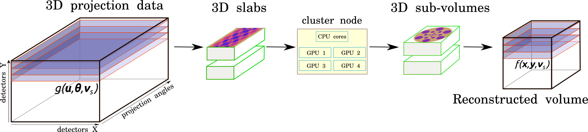

HTTomo concept
*******************

HTTomo stands for High Throughput Tomography pipeline for processing and reconstruction of parallel-beam tomography data.
The `HTTomo project <https://github.com/DiamondLightSource/httomo>`_ was initiated in 2022 at `Diamond Light source  <https://www.diamond.ac.uk/>`_ by the Data Analysis Group and it is written in Python.
With the `Diamond-II  <https://www.diamond.ac.uk/Home/About/Vision/Diamond-II.html>`_ upgrade approaching, there is a
need to be able to process bigger data in larger quantities and with high fidelity. With the support of modern developments in
the field of High Performance Computing and multi-GPU processing, it is possible to enable faster data streaming and higher throughput for big data.

The main concept of HTTomo is to split the data into three-dimensional (3D) chunks and process them in parallel. The speed is gained using
the optimised I/O modules, in-memory reslicing operations using MPI protocols, and a capability of device-to-device GPU processing using the `CuPy <https://cupy.dev/>`_ library.
HTTomo orchestrates the optimal data splitting driven by the available GPU memory, which makes possible processing and reconstruction of big data on smaller GPU cards.

    HTTomo is tailored to work with 3D data, here 3D parallel-beam tomographic projection data is split and sent to a cluster with multiple GPUs for processing and reconstruction. Serial processing of data is also possible.

HTTomo is a User Interface (UI) package and does not contain any data processing methods, but rather utilises other libraries as `backends <https://en.wikipedia.org/wiki/Frontend_and_backend>`_.
Please see the list of currently supported packages by HTTomo in :ref:`backends_list`. In principle, it should possible to enable any other modular
library for data processing methods in HTTomo using :ref:`reference_templates` as a frontend interface.

A complex data analysis pipelines can be built by stacking together YAML templates, which are provided at the documentation page. :ref:`tutorials_pl_templates` of ready to be used full pipelines are also provided.
