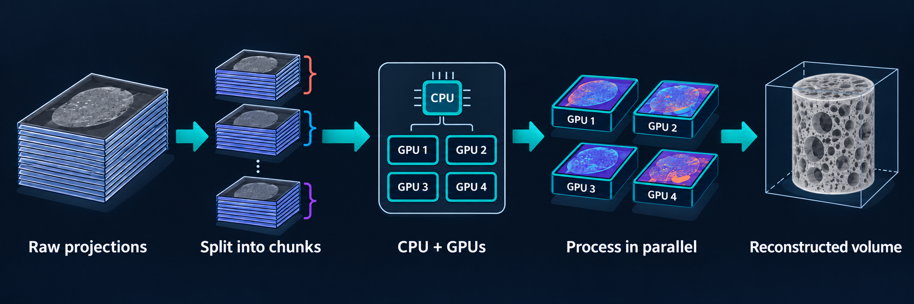

About HTTomo
************

- High Throughput Tomography (HTTomo) is a Python framework for high-throughput processing and reconstruction of parallel-beam tomography data.

- Developed at `Diamond Light source  <https://www.diamond.ac.uk/>`_ to support the growing data demands of `Diamond-II  <https://www.diamond.ac.uk/Home/About/Vision/Diamond-II.html>`_ upgrade.

- It splits large 3D datasets into memory-efficient chunks and processes them in parallel across multiple GPUs.

- Performance comes from optimised I/O, MPI-based in-memory operations, GPU accelerated methods, and CuPy device-to-device processing.

- HTTomo orchestrates external CPU/GPU processing libraries rather than providing processing methods itself.

- Users build complex workflows by combining reusable YAML pipeline templates.

    HTTomo is tailored to work with 3D data, here 3D parallel-beam tomographic projection data is split and sent to a cluster with multiple GPUs for processing and reconstruction.

.. toctree::
   :maxdepth: 2

   indepth/detailed_about
