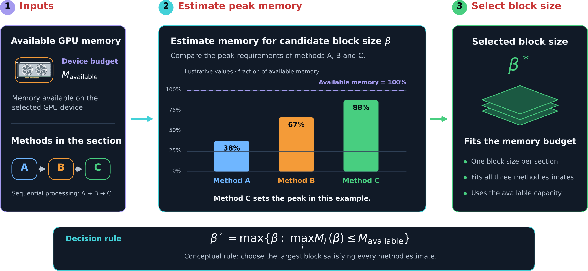

.. _info_memory_estimators:

GPU memory estimation
=====================

HTTomo uses GPU memory estimators to determine how many data slices can be processed
at once. This defines the size of the :ref:`blocks <blocks_data>` used within each
:ref:`section <info_sections>`.

.. _fig_gpu_memory_estimation:

   HTTomo selects the largest block size that satisfies the memory requirements of
   every method in a section.

Selecting a block size
~~~~~~~~~~~~~~~~~~~~~~

HTTomo first determines the available memory on the selected GPU. For a candidate
block size, each GPU method in the section estimates its peak memory use, including
its inputs, outputs and temporary allocations.

The most memory-demanding method limits the block size. HTTomo selects the largest
block that fits the available memory for every method, then uses that size
throughout the section.

Why block size matters
~~~~~~~~~~~~~~~~~~~~~~

Larger blocks use the GPU more efficiently and reduce the number of data transfers
and method calls. The memory estimators maximise block size while preventing
out-of-memory failures.

Memory requirements vary between methods and may depend on the data shape, data
type and method parameters. See :ref:`developers_memorycalc` for details about
implementing and testing GPU memory estimators.