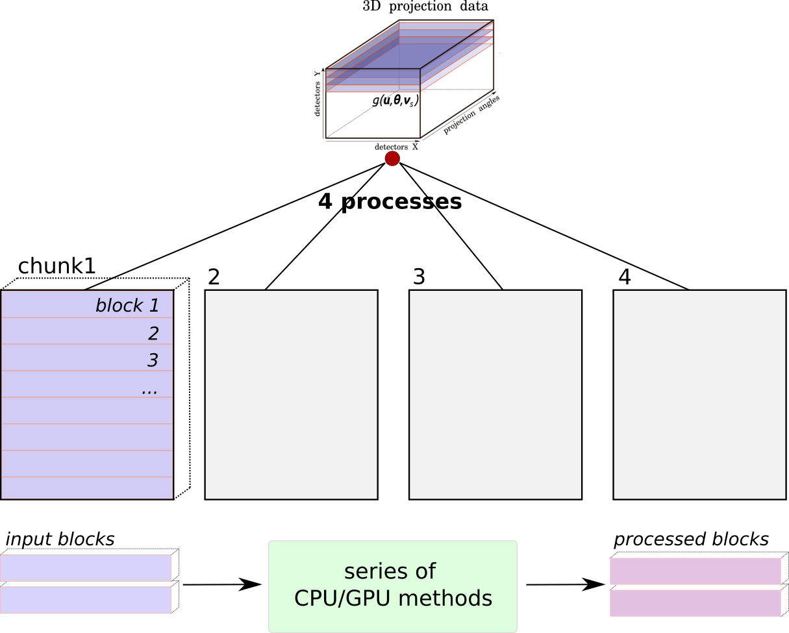

.. _blocks_data:

Blocks
======

Definition
~~~~~~~~~~

When a chunk (see :ref:`chunks_data`) is split into smaller pieces, these smaller pieces are called
*blocks*.

.. _fig_blocks1:

    An example of the data being divided into 4 parallel processes which are associated with 4 :ref:`chunks_data` of data. In each chunk there could be one or a number of blocks, depending on the information provided by :ref:`info_memory_estimators`.

Motivation
~~~~~~~~~~

Notes on the framework's approach to data
'''''''''''''''''''''''''''''''''''''''''

HTTomo's framework has been written with the use of GPUs in mind. More
specifically, HTTomo is geared towards filling up the available GPU memory with as
much data as possible, within a reasonable tolerance to the limit.

HTTomo's framework has also been written with the idea in mind that data, even
after splitting into chunks, may or may not fit into GPU memory. This applies to
both most commonly used hardware setups: compute clusters and personal machines.

Similarly, data may or may not even fit into CPU memory (RAM) without splitting it
into smaller pieces and holding only one piece in memory at a time. This also
applies to both most commonly used hardware setups (as surprising as it may first
sound, there is indeed the case where data not fitting in RAM can happen even with
nodes in compute clusters!).

Why split a "chunk" into smaller pieces?
''''''''''''''''''''''''''''''''''''''''

Each MPI process is associated with one GPU, and earlier it was mentioned that each
MPI process has one chunk to work with. So, each MPI process has the task of trying
to fit as much of its chunk into the memory of the GPU it is using, for every
method in the pipeline.

Highlighting one use-case, in order for HTTomo to be usable on personal machines as
well as compute clusters, it's necessary to *not assume* that a single chunk can
fit into GPU memory. For example, data of size 20GB when running with four MPI
processes would result in chunks of size ~5GB. Compute clusters equipped with GPUs
would likely have GPU models with memory far exceeding 5GB, and so could easily fit
the entire 5GB chunk into GPU memory. However, a personal machine with a discrete
GPU may only have, say, 4GB of memory; in which case, a 5GB chunk wouldn't fit in
GPU memory.

To generically handle the possibility that a single chunk may not fit into GPU
memory (among other reasons), a chunk is split into smaller pieces. The pieces that
a chunk is split into are called *blocks*.

How are block shapes calculated?
~~~~~~~~~~~~~~~~~~~~~~~~~~~~~~~~

The size of a block when splitting a chunk varies on a case-by-case basis, and is a
calculation that the HTTomo framework performs during pipeline execution.

More specifically, when a chunk is split into multiple blocks for a sequence of
methods, each block is roughly the same shape. However, at another stage in the
pipeline with a different sequence of methods, a chunk may be split into multiple
blocks where the block shape is *different* to the previous block shape.

The block size calculation uses information in the :ref:`library
files<pl_library>`, as well as the GPU memory that is available at the time of
calculation.

The size of a block is mainly based on:

- the GPU memory available to the process
- a method's memory requirements (more precisely, the memory requirements of the
  GPU methods in a section, see :ref:`info_sections` for information on what
  "sections" are)

At a high-level, the size of a block is given in terms of the number of slices that
it contains. For example, if the data was split and distributed among the MPI
processes as projections, then:

- each process has a *chunk* of projections
- when each process splits its chunk into *blocks*, each block will contain a
  certain number of projection slices

The analagous explanation for the sinogram case, replacing "projections" with
"sinograms" in the above, holds true too.

Blocks as the fundamental data quantity in HTTomo
~~~~~~~~~~~~~~~~~~~~~~~~~~~~~~~~~~~~~~~~~~~~~~~~~

Blocks are the level at which most objects in HTTomo interact with, for example:

1. loaders load individual blocks
2. methods take individual blocks as input
3. methods produce individual blocks as output

There are indeed edge cases where a block can span the entire chunk from which it
comes from, in which case the chunk an MPI process has and the single block from it
have the same shape. However, as far as the framework knows, it is dealing with
blocks.

Therefore, a block could be considered as the fundamental data quantity in HTTomo's
framework.

Example
~~~~~~~

The example given in the chunks section had started with:

- the input 3D data has shape :code:`(180, 128, 160)`
- HTTomo has been executed with two MPI processes
- each chunk has shape :code:`(90, 128, 160)`

Continuing on from this, suppose that the GPU for both processes was such that only
half of the stack of projections could fit into the GPU's memory at one time. Ie, a
:code:`(45, 128, 160)` subset of a chunk could fit into GPU memory and no more.

Each MPI process would split its chunk of shape :code:`(90, 128, 160)` into two
*blocks* of shape :code:`(45, 128, 160)`. Very roughly speaking, after this
splitting, each MPI process would then proceed to pass each :code:`(45, 128, 160)`
block into the current method.
