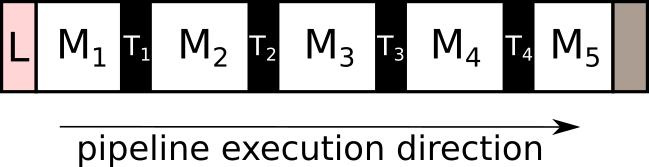

.. _detailed_about:

Detailed concepts
+++++++++++++++++

Here we present more detailed concepts of HTTomo's framework, such as,
:ref:`info_sections`, :ref:`info_reslice`, :ref:`info_data`, *method wrappers*,
gpu-memory aware processing and others.

.. _info_sections:

Sections
--------

Sections is the essential element of HTTomo's framework which is related to how the I/O operations and processing of data is organised. 

.. note:: The main purpose of sections is to organise the data input/output workflow, as well as, chaining together the processing elements so that the constructed pipeline is computationally efficient. 

In order to understand how sections are formed, we give here the list of rules with examples when sections are created.

.. _fig_sec1:

    Here is a typical pipeline with with a loader (`L`), 5 methods (`M`), and 4 data transfer operations (`T`) between methods. 

Sections are created when:

1. :ref:`info_reslice` is needed, which is related to the change of pattern.
2. The output of the method needs to be saved to the disk.
3. The :ref:`side_output` is required by one of the methods.

Example 1: Sections with re-slice
=================================

.. _fig_sec2:
.. figure::  ../../_static/sections2.png
    :scale: 40 %
    :alt: Sections in pipelines

    Let us say that the pattern in methods `M`\ :sub:`1-3` is *projection* and methods in `M`\ :sub:`4-5` belong to *sinogram* pattern.
    This will result in two sections created and also :ref:`info_reslice` operation in the data transfer `T`\ :sub:`3` layer. 

Example 2 : Sections with re-slice and data saving
==================================================

.. _fig_sec3:
.. figure::  ../../_static/sections3.png
    :scale: 40 %
    :alt: Sections in pipelines

    In addition Example 1 situation, let us assume that we want to save the result of `M`\ :sub:`2` method to the disk. 
    This means that even though `M`\ :sub:`1-3` methods can be performed on the GPU, the data will be transferred to CPU.
    The pipeline will be further fragmented to introduce another section, so that the data transfer `T`\ :sub:`2` layer also saves the data on the 
    disk, as well as, taking care to return the data back on the GPU for the method `M`\ :sub:`3`. One can see that this is not efficient. 

.. note:: It can be seen that creating more sections in the pipeline is best to be avoided when building an efficient pipeline. 

.. _info_reslice:

Re-slicing
----------
The re-slicing of data happens when we need to access a slice which is orthogonal to the current one. 
In tomography, we normally work in the space of projections or in the space of sinograms. Different methods require different slicing 
orientations, or, as we call it, a *pattern*. The change of the pattern is a **re-slice** operation or a transformation of an array by 
re-slicing in a particular direction. For instance, from the projection space/pattern to the sinogram space/patterns, as in the figure bellow.

.. _fig_reslice:
.. figure::  ../../_static/reslice.png
    :scale: 40 %
    :alt: Reslicing procedure

    The re-slicing operation for tomographic data. Here the data is resliced from the stack of projections to the stack of sinograms.

In HTTomo, the re-slicing operation is performed on the CPU as we need to access all the data. Even if the pipeline consists of only GPU methods stacked together, 
the re-slicing step will transfer the data from the GPU device to the CPU memory first. This operation can be costly for big datasets and we recommend to minimise the number of 
re-slicing operations in your pipeline. Normally for tomographic pre-processing and reconstruction there is just one re-slice needed, please see how :ref:`howto_process_list`.

.. note:: Note that when the CPU memory is not enough to perform re-slicing operation, the operation will be performed through the disk. This is substantially slower.

.. _info_data:

Data terminology
----------------

HTTomo's framework deals with handling all the data involved in executing the
pipeline. "Data handling" in HTTomo involves operations such as splitting data up
into pieces, passing the pieces of data into methods, gathering data up and
re-splitting into a different set of pieces, and more.

The concept of data being split into smaller pieces is a common theme in HTTomo,
and there naturally arose two main "levels" of data splitting. These two levels
have been given names, as an easy way to give some context to a piece of data when
referring to it.

One level of data splitting produces a piece of data called a *chunk* (not to be
confused with the term "chunk" used in the hdf5 data format), and the other level
of data splitting produces a piece of data called a *block*.

Chunks
======

Definition
~~~~~~~~~~

When data is split into pieces and distributed among the MPI processes (one piece
per process), these pieces are called *chunks*.

Motivation: distributing data across MPI processes
~~~~~~~~~~~~~~~~~~~~~~~~~~~~~~~~~~~~~~~~~~~~~~~~~~

HTTomo is able to run with multiple processes using MPI. The main idea is that
HTTomo is given input data, and each process gets a subset of the input data. Thus,
the input data is split, and each MPI process gets one piece. The pieces that the
input data is split into are called *chunks*. So, in this terminology, each MPI
process has one chunk to work with. (Again, the term "chunk" here shouldn't be
confused with the hdf5 notion of a chunk!)

How are chunk shapes calculated?
~~~~~~~~~~~~~~~~~~~~~~~~~~~~~~~~

The chunk shape calculation is simple and is based on:

- the number of MPI processes HTTomo is launched with
- the shape of the "full data"

The data is split such that each chunk is as close to the same shape as other
chunks. If the data is being split as projections, then each MPI process gets a
chunk with roughly the same number of projections. Similarly, if the data is being
split as sinograms, then each MPI process gets a chunk with roughly the same number
of sinograms.

.. note:: If the data doesn't split evenly, then the MPI process with the largest
   rank is the one that gets a chunk with the shape that's the "odd one out"

Example
~~~~~~~

Consider 3D input data with shape :code:`(180, 128, 160)` (ie, 180 projections,
where each projection has dimensions :code:`(128, 160)`), and running HTTomo with
two MPI processes.

If evenly splitting the data along the first axis of length :code:`180`, this
results in two pieces, each with shape :code:`(90, 128, 160)`. Each piece would be
referred to as a "chunk" in HTTomo, and each MPI process would get one of these
:code:`(90, 128, 160)` shaped chunks.

Blocks
======

Definition
~~~~~~~~~~

When a chunk is split into smaller pieces, these smaller pieces are called
*blocks*.

Motivation
~~~~~~~~~~

Notes on the framework's approach to data
'''''''''''''''''''''''''''''''''''''''''

HTTomo's framework has been written with the use of GPUs in mind. More
specifically, HTTomo is geared towards filling up the available GPU memory with as
much data as possible, within a reasonable tolerance to the limit.

HTTomo's framework has also been written with the idea in mind that data, even
after splitting into chunks, may or may not fit into GPU memory. This applies to
both most commonly used hardware setups: compute clusters and personal machines.

Similarly, data may or may not even fit into CPU memory (RAM) without splitting it
into smaller pieces and holding only one piece in memory at a time. This also
applies to both most commonly used hardware setups (as surprising as it may first
sound, there is indeed the case where data not fitting in RAM can happen even with
nodes in compute clusters!).

Why split a "chunk" into smaller pieces?
''''''''''''''''''''''''''''''''''''''''

Each MPI process is associated with one GPU, and earlier it was mentioned that each
MPI process has one chunk to work with. So, each MPI process has the task of trying
to fit as much of its chunk into the memory of the GPU it is using, for every
method in the pipeline.

Highlighting one use-case, in order for HTTomo to be usable on personal machines as
well as compute clusters, it's necessary to *not assume* that a single chunk can
fit into GPU memory. For example, data of size 20GB when running with four MPI
processes would result in chunks of size ~5GB. Compute clusters equipped with GPUs
would likely have GPU models with memory far exceeding 5GB, and so could easily fit
the entire 5GB chunk into GPU memory. However, a personal machine with a discrete
GPU may only have, say, 4GB of memory; in which case, a 5GB chunk wouldn't fit in
GPU memory.

To generically handle the possibility that a single chunk may not fit into GPU
memory (among other reasons), a chunk is split into smaller pieces. The pieces that
a chunk is split into are called *blocks*.

How are block shapes calculated?
~~~~~~~~~~~~~~~~~~~~~~~~~~~~~~~~

The size of a block when splitting a chunk varies on a case-by-case basis, and is a
calculation that the HTTomo framework performs during pipeline execution.

More specifically, when a chunk is split into multiple blocks for a sequence of
methods, each block is roughly the same shape. However, at another stage in the
pipeline with a different sequence of methods, a chunk may be split into multiple
blocks where the block shape is *different* to the previous block shape.

The block size calculation uses information in the :ref:`library
files<pl_library>`, as well as the GPU memory that is available at the time of
calculation.

The size of a block is mainly based on:

- the GPU memory available to the process
- a method's memory requirements (more precisely, the memory requirements of the
  GPU methods in a section, see :ref:`info_sections` for information on what
  "sections" are)

At a high-level, the size of a block is given in terms of the number of slices that
it contains. For example, if the data was split and distributed among the MPI
processes as projections, then:

- each process has a *chunk* of projections
- when each process splits its chunk into *blocks*, each block will contain a
  certain number of projection slices

The analagous explanation for the sinogram case, replacing "projections" with
"sinograms" in the above, holds true too.

Blocks as the fundamental data quantity in HTTomo
~~~~~~~~~~~~~~~~~~~~~~~~~~~~~~~~~~~~~~~~~~~~~~~~~

Blocks are the level at which most objects in HTTomo interact with, for example:

1. loaders load individual blocks
2. methods take individual blocks as input
3. methods produce individual blocks as output

There are indeed edge cases where a block can span the entire chunk from which it
comes from, in which case the chunk an MPI process has and the single block from it
have the same shape. However, as far as the framework knows, it is dealing with
blocks.

Therefore, a block could be considered as the fundamental data quantity in HTTomo's
framework.

Example
~~~~~~~

The example given in the chunks section had started with:

- the input 3D data has shape :code:`(180, 128, 160)`
- HTTomo has been executed with two MPI processes
- each chunk has shape :code:`(90, 128, 160)`

Continuing on from this, suppose that the GPU for both processes was such that only
half of the stack of projections could fit into the GPU's memory at one time. Ie, a
:code:`(45, 128, 160)` subset of a chunk could fit into GPU memory and no more.

Each MPI process would split its chunk of shape :code:`(90, 128, 160)` into two
*blocks* of shape :code:`(45, 128, 160)`. Very roughly speaking, after this
splitting, each MPI process would then proceed to pass each :code:`(45, 128, 160)`
block into the current method.
