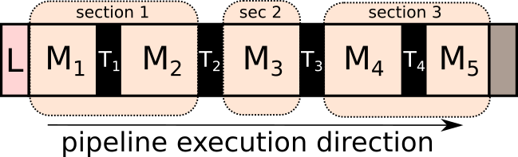

.. _detailed_about:

Detailed concepts
+++++++++++++++++

Here we present more detailed concepts of HTTomo's framework, such as, :ref:`info_sections`, :ref:`info_reslice`, *blocks*, *method wrappers*, gpu-memory aware processing and others.

.. _info_sections:

Sections
--------

Sections is the essential element of HTTomo's framework which is related to how the I/O operations and processing of data is organised. 

.. note:: The main purpose of sections is to organise the data input/output workflow, as well as, chaining together the processing elements so that the constructed pipeline is computationally efficient. 

In order to understand how sections are formed, we give here the list of rules with examples when sections are created.

.. _fig_sec1:
.. figure::  ../../_static/sections1.png
    :scale: 40 %
    :alt: Sections in pipelines

    Here is a typical pipeline with with a loader (`L`), 5 methods (`M`), and 4 data transfer operations (`T`) between methods. 

Sections are created when:

1. :ref:`info_reslice` is needed, which is related to the change of pattern.
2. The output of the method needs to be saved to the disk.
3. The :ref:`side_output` is required by one of the methods.

Example 1: Sections with re-slice
=================================

.. _fig_sec2:
.. figure::  ../../_static/sections2.png
    :scale: 40 %
    :alt: Sections in pipelines

    Let us say that the pattern in methods `M`\ :sub:`1-3` is *projection* and methods in `M`\ :sub:`4-5` belong to *sinogram* pattern.
    This will result in two sections created and also :ref:`info_reslice` operation in the data transfer `T`\ :sub:`3` layer. 

Example 2 : Sections with re-slice and data saving
==================================================

.. _fig_sec3:

    In addition Example 1 situation, let us assume that we want to save the result of `M`\ :sub:`2` method to the disk. 
    This means that even though `M`\ :sub:`1-3` methods can be performed on the GPU, the data will be transferred to CPU.
    The pipeline will be further fragmented to introduce another section, so that the data transfer `T`\ :sub:`2` layer also saves the data on the 
    disk, as well as, taking care to return the data back on the GPU for the method `M`\ :sub:`3`. One can see that this is not efficient. 

.. note:: It can be seen that creating more sections in the pipeline is best to be avoided when building an efficient pipeline. 

.. _info_reslice:

Re-slicing
----------
The re-slicing of data happens when we need to access a slice which is orthogonal to the current one. 
In tomography, we normally work in the space of projections or in the space of sinograms. Different methods require different slicing 
orientations, or, as we call it, a *pattern*. The change of the pattern is a **re-slice** operation or a transformation of an array by 
re-slicing in a particular direction. For instance, from the projection space/pattern to the sinogram space/patterns, as in the figure bellow.

.. _fig_reslice:
.. figure::  ../../_static/reslice.png
    :scale: 40 %
    :alt: Reslicing procedure

    The re-slicing operation for tomographic data. Here the data is resliced from the stack of projections to the stack of sinograms.

In HTTomo, the re-slicing operation is performed on the CPU as we need to access all the data. Even if the pipeline consists of only GPU methods stacked together, 
the re-slicing step will transfer the data from the GPU device to the CPU memory first. This operation can be costly for big datasets and we recommend to minimise the number of 
re-slicing operations in your pipeline. Normally for tomographic pre-processing and reconstruction there is just one re-slice needed, please see how :ref:`howto_process_list`.

.. note:: Note that when the CPU memory is not enough to perform re-slicing operation, the operation will be performed through the disk. This is substantially slower.

.. _info_blocks:

Blocks
-------
to be added...