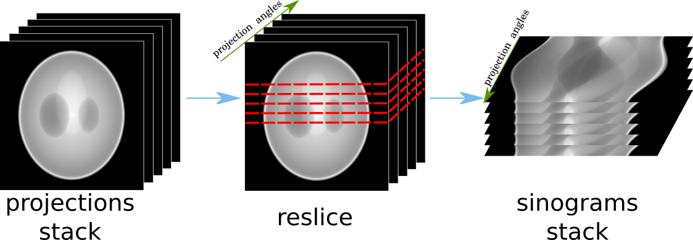

.. _detailed_about:

Detailed concepts
+++++++++++++++++

Here we present more detailed concepts of HTTomo's framework, such as, :ref:`info_sections`, :ref:`info_reslice`, *blocks*, *method wrappers*, gpu-memory aware processing and others.

.. _info_sections:

Sections
--------

Sections is the essential element of HTTomo's framework which is related to how the I/O operations and processing of data is organised. 

.. note:: The main purpose of sections is to organise the data input/output workflow, as well as, chaining together the processing elements so the constructed pipeline is computationally efficient. 

In order to understand how sections are formed we give here the list of rules when sections are created. 

.. _info_reslice:

Re-slicing
----------
The re-slicing of data happens when we need to access a slice which is orthogonal to the current one. 
In tomography, we normally work in the space of projections or in the space of sinograms. Different methods require different slicing 
orientations, or, as we call it, a *pattern*. The change of the pattern is a **re-slice** operation or a transformation of an array by 
re-slicing in a particular direction. For instance, from the projection space/pattern to the sinogram space/patterns, as in :numref:`fig_reslice`.

.. _fig_reslice:

    The re-slicing operation for tomographic data. The transformation from the stack of projections to the stack of sinograms by slicing the 3D array in the direction parallel to the projection angles.

In HTTomo, the re-slicing operation is performed on the CPU as we need to access all the data. Even if the pipeline consists of only GPU methods stacked together, 
the re-slicing step will transfer the data from the GPU device to the CPU memory. This operation can be costly for big datasets and we recommend to minimise the number of 
re-slicing operations in your pipeline. Normally for tomographic pre-processing and reconstruction there is just one re-slice needed. HTTomo checks if there is more than 
one reslice in the pipeline and warn the user about it. The user will be prompted to change the order of the methods to minimise the number of the reslicing operations. 

For example to execute the methods bellow, **two** re-slicing operations needed:

.. code-block:: yaml
    
    1. normalisation
    2. median_filter
    3. centering
    4. paganin_filter
    5. reconstruction

The main issue here is that the :code:`centering` method requires pattern to be `sinogram`, :code:`paganin_filter` needs `projections` and 
:code:`reconstruction` needs sinogram pattern again. Therefore we need to re-slice two times to accommodate for that. To remove one 
reslice operation and obtain exactly the same result (but quicker), one needs to change the order of methods like this: 

.. code-block:: yaml
    
    1. normalisation
    2. median_filter
    3. paganin_filter
    4. centering    
    5. reconstruction

To conclude, it is useful to look for the order of methods in your pipelines and 
rearrange them to reduce the amount of potentially unnecessary reslicing steps.

.. _info_blocks:

Blocks
-------
to be added...