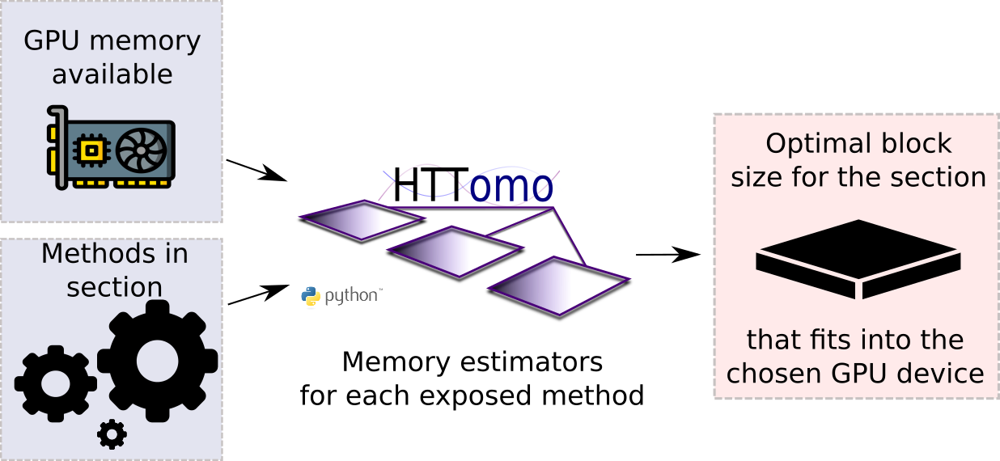
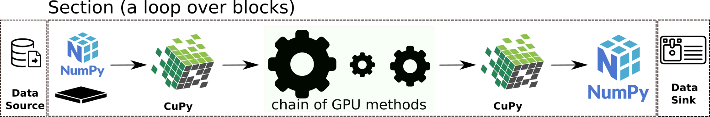

.. _info_memory_estimators:

Memory Estimators
-----------------

Memory estimators is the integral part of HTTomo when it comes to the GPU processing and efficient device-to-device transfers.

.. note:: One needs to know how much of the data safely fits a GPU card. This is the main purpose of the GPU memory estimators in HTTomo.

Based on the free memory available in the GPU device and memory requirements of a particular method, GPU memory estimators will initiate
:ref:`developers_memorycalc` to decide how much of the data can be safely transferred to the GPU for processing. The size of the data
that can be fitted in the GPU card for computations will define the size of the :ref:`blocks_data`.

.. _fig_memest1:

    Free memory of the GPU device and the method's memory requirement is the information that is required for memory estimators to define the size of the :ref:`blocks_data` in the :ref:`info_sections`.

As one would like to minimise device-to-device transfers while doing GPU computations, HTTomo tries to chain the methods together in one Section.
Therefore if there are multiple methods chained together, the size of the block will be defined by the most memory-demanding method.
Memory estimators will inspect every method in that methods' chain in order to decide which one dominates.

.. _fig_memest2:

    A chain of GPU methods will be executed in loop over blocks. GPU memory estimators will make sure that the memory requirements will be satisfied for all of them.