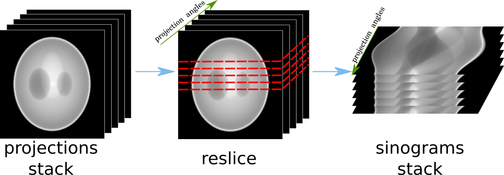
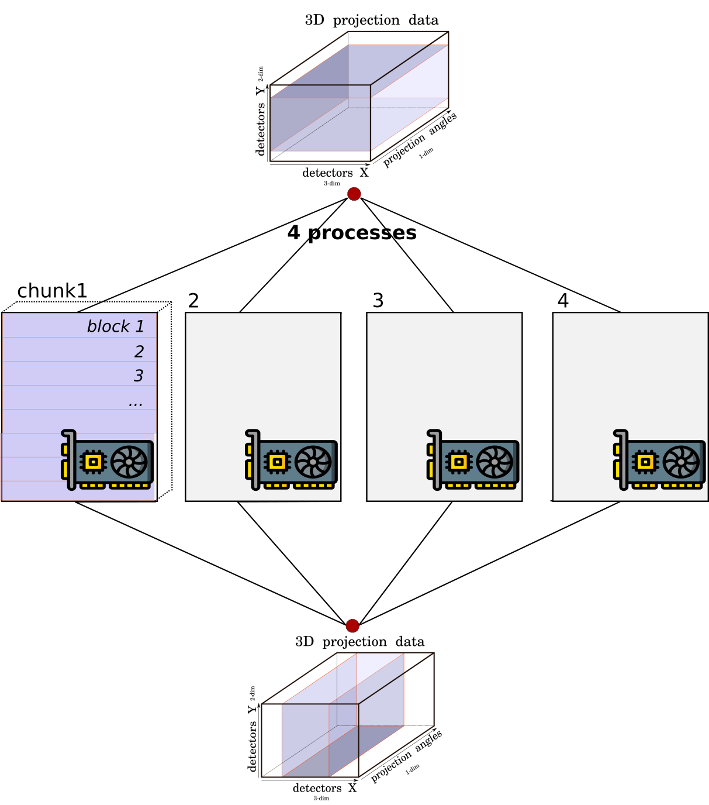

.. _info_reslice:

Re-slicing
----------
The re-slicing of data happens when we need to access a slice which is orthogonal to the current one.
In tomography, we normally work in the space of projections or in the space of sinograms. Different methods require different slicing
orientations, or, as we call it, a *pattern*. The change of the pattern is a **re-slice** operation or a transformation of an array by
re-slicing in a particular direction. For instance, from the projection space/pattern to the sinogram space/patterns, as in the figure below.

.. _fig_reslice:

    The re-slicing operation for tomographic data. Here the data is resliced from the stack of projections to the stack of sinograms.

In HTTomo, the re-slicing operation is performed on the CPU as we need to access all the data. Even if the pipeline consists of only GPU methods stacked together,
the re-slicing step will transfer the data from the GPU device to the CPU memory first. This operation can be costly for big datasets and we recommend to minimise the number of
re-slicing operations in your pipeline. Normally for tomographic pre-processing and reconstruction there is just one re-slice needed, please see how :ref:`howto_process_list`.

.. _fig_reslice2:

    Data needs to be gathered from the GPU devices to transfer to the CPU memory (or a disk) in order to perform the re-slicing procedure.

.. note:: Note that when the CPU memory is not enough to perform re-slicing operation, the operation will be performed through the disk. This is substantially slower and the processing becomes heavily I/O bounded.
