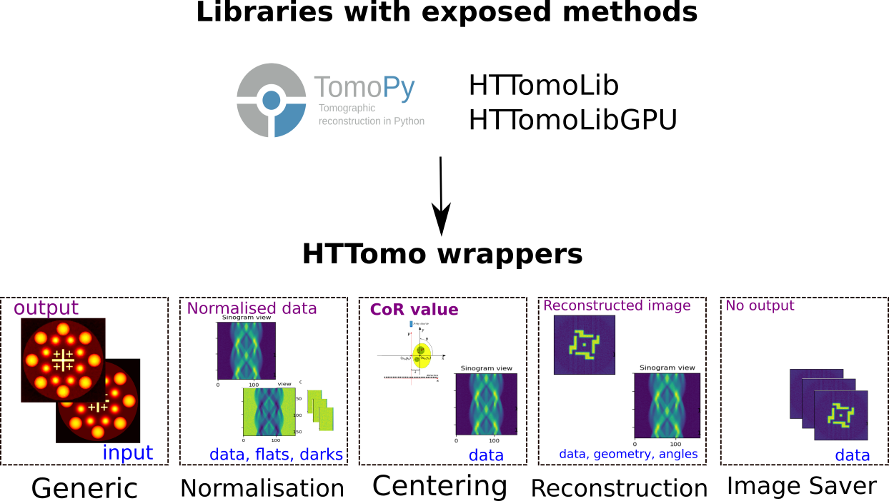

.. _info_wrappers:

Method Wrappers
===============

HTTomo does not contain image processing methods and uses external libraries for processing, see :ref:`backends_list`.
However, because methods process data in a different manner, there's a need to tell the framework what kind of processing that is.

HTTomo currently has the following wrappers:

1. The generic wrapper. Suitable when the method does not change the dimensions of the data for its output and requires one input and one output. This also can be called a filter.

2. Normalisation wrapper is to deal with normalisation methods as they have supplementary data as an input (e.g. flats/darks) and one dataset as an output.

3. Rotation or Centering wrapper. These are special methods to estimate :ref:`centering` automatically. The input can be quite specific, e.g. normalised sinogram or selected projections, and the output is usually a scalar.

4. Reconstruction wrapper. Reconstruction needs an additional information to be passed like angles and the centre of rotation. This is all handled by the framework in the wrapper.

5. Image Saving wrapper. This wrapper is needed because no output in HTTomo is produced, we just save images to the disk.

.. _fig_wrappers:

    Wrappers of HTTomo deal with the i/o differences in methods from the external libraries.
