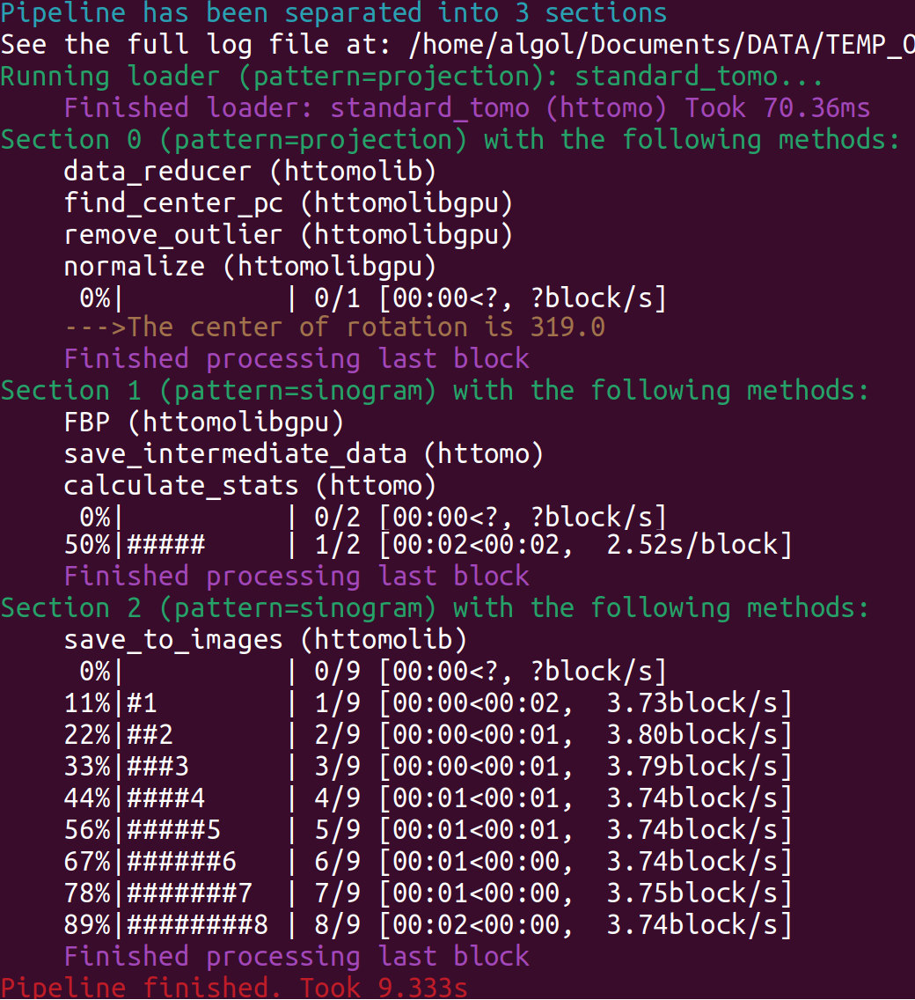

.. _info_logger:

Run output and log messages
===========================

HTTomo uses ``loguru`` for logging. A run can produce:

* ``user.log``, containing the same concise progress information shown in the
  terminal;
* ``debug.log``, containing additional information for diagnosing problems;
* a copy of the pipeline, retaining its source filename;
* HDF5 files requested with ``save_result: true`` or the ``--save-all`` option;
  and
* snapshot images when ``--save-snapshots`` is used.

See :ref:`run-httomo-indepth` for the output-related command-line options.

.. _fig_log:

   Terminal output, which is also recorded in ``user.log``.

Common log messages
+++++++++++++++++++

``Pipeline has been separated into N sections``
   The pipeline has been divided into ``N`` :ref:`info_sections`. Each section
   groups methods that process the data as :ref:`chunks_data` and
   :ref:`blocks_data`. A section processes all its input data before the next
   section starts.

``Running loader``
   The loader runs before the pipeline sections. It initially loads data using
   the ``projection`` pattern, which is also used by the first section. See
   :ref:`info_reslice`.

``Section N with the following methods``
   The listed methods run sequentially on each block in the section.
   ``Finished processing the last block`` indicates that the section has
   processed all its input data.

A progress bar may look like this:

.. code-block:: text

   50%|#####     | 1/2 [00:02<00:02, 2.52s/block]

It reports progress through the data blocks, not through individual methods:

``50%`` and ``1/2``
   One of two blocks has been processed.

``00:02<00:02``
   Two seconds have elapsed and approximately two seconds remain.

``2.52s/block``
   The estimated processing time per block. For faster operations, this may
   instead be displayed as blocks per second (``block/s``).

.. note::

   A block may be processed by several methods. The progress bar therefore
   counts completed blocks rather than completed methods.
